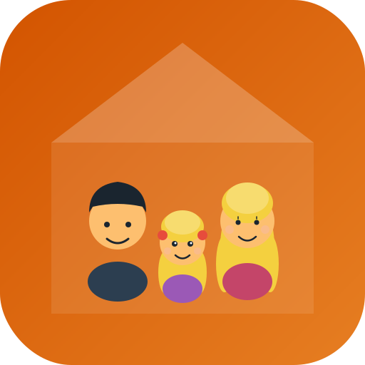

# 🎰 Casa Casino

Eine Family Organization PWA für Max, Anna und Valerie.

## Features

### 📅 Ich
- Tagesübersicht mit personalisiertem Greeting
- Status-Karten (Zeit für mich / Eingeplant)
- Heute Abend Essensplan
- To-Do Liste

### 👶 Valerie
- Tageskalender (7:00 - 21:00)
- Multi-Select für Zeitslots
- Popup-Auswahl: Kiga / Papa / Mama / Beide
- Morgen & Abend Routinen (editierbar)

### 🏠 Haus
- Interaktiver Grundriss
- Einrichtungs-Checklisten pro Raum
- Status: Fehlt / Geht so / Passt
- Progress-Tracking

### 🍽️ Meals
- Wochenplan mit Mittag/Abend Toggle
- Rezepte mit Zutaten erstellen
- Automatisch aggregierte Einkaufsliste
- "Schon zu Hause" markieren
- 🎲 Überraschungs-Würfel

### 💜 Wir
- Date Night Planer
- Danke Notizen
- Gemeinsame Ziele

## Installation

Einfach `index.html` im Browser öffnen oder auf GitHub Pages hosten.

## Tech Stack

- Vanilla HTML/CSS/JavaScript
- Keine Dependencies
- PWA-ready
- Mobile-first Design

---

Made with ❤️ for our family
